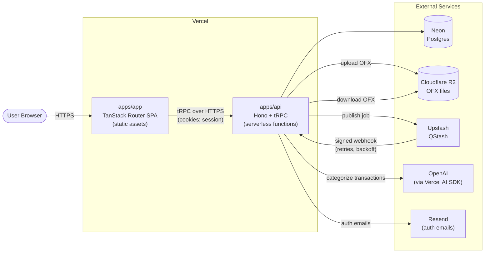
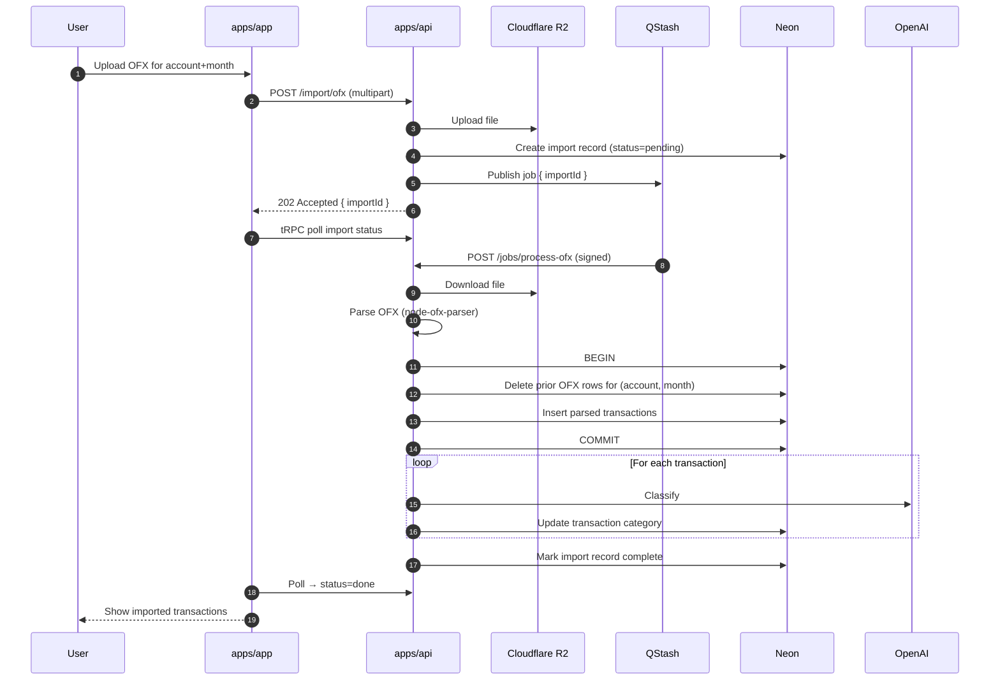

# Caramelo — Architecture

This document describes **how** Caramelo is built. What the product does is specified in [`SPEC.md`](./SPEC.md) — this document is the contract between developers and does not describe product behavior.

Architecture decisions are recorded here in the shape of the system as of v1. When a decision changes, update this document in the same PR as the code that changes it.

> **Delivery stance.** Caramelo is a hobby project. We optimize for simplicity over operational robustness. We do not invest in zero-downtime deploy discipline, feature flags, error monitoring, or blue/green rollouts. Breakage during deploys is acceptable.

---

## 1. System Topology



Frontend and backend are deployed as **two separate Vercel projects** in the same account. They communicate over HTTPS, with session cookies scoped to a shared parent domain (see §6).

---

## 2. Monorepo Layout

Package manager: **pnpm** with pnpm workspaces. No Turborepo.

```
caramelo/
├── apps/
│   ├── app/                      # TanStack Router + Vite SPA
│   └── api/                      # Hono + tRPC backend
├── packages/
│   ├── auth/                     # Better Auth configuration
│   ├── db/                       # Drizzle schema, migrations, client factory
│   ├── email/                    # Resend client + pt-BR email templates
│   ├── eslint-config/            # Shared ESLint + Prettier config
│   ├── shared/                   # Common code shared across packages (types, utils, constants)
│   └── typescript-config/        # Shared tsconfig base files
├── pnpm-workspace.yaml
├── package.json
├── README.md
├── SPEC.md
└── ARCHITECTURE.md
```

### Workspace rules

- Each package and app has its own `package.json` and `tsconfig.json` that extends `@caramelo/typescript-config`.
- Every package exports via `exports` field in `package.json` — no deep imports (`@caramelo/db/src/schema/users.ts` is forbidden; `@caramelo/db` must re-export what consumers need).
- `apps/app` imports the tRPC router **type** from `apps/api` via the workspace. This type is erased at build time; there is no runtime coupling between the two deploys.
- `packages/db` is imported by `apps/api` and (potentially) by migration/seed scripts. The frontend never imports it.

### Why no Turborepo

v1 has two apps and six small packages. Turborepo's caching and pipeline orchestration add complexity we don't need at this size. If build times become painful, revisit.

---

## 3. Frontend — `apps/app`

**Stack:**

- [TanStack Router](https://tanstack.com/router) (file-based routing)
- [Vite](https://vitejs.dev/) (build tool)
- React 19
- [TanStack Query](https://tanstack.com/query) (data cache — via tRPC)
- [@trpc/tanstack-react-query](https://trpc.io/docs/client/tanstack-react-query) (tRPC binding)
- [TailwindCSS](https://tailwindcss.com/) + [shadcn/ui](https://ui.shadcn.com/)
- [React Hook Form](https://react-hook-form.com/) + [Zod](https://zod.dev/) (forms)
- Light mode only (no `next-themes` or dark variants)

### Deployment

Vite builds a static bundle (`dist/`) that is served as a Vercel static deployment. All rendering is client-side. There are no Server Components, no Server Actions, no SSR.

### Routing

File-based routing. Each file in `src/routes/*` becomes a route. TanStack Router generates a typed route tree at build time.

Auth protection is handled by a route guard (e.g., a wrapping layout that checks session via tRPC and redirects to `/login`). No middleware running on the edge — the browser owns all routing decisions.

### Data loading

Component-level queries via `useQuery` / `useMutation` from the tRPC hook layer. No TanStack Router route loaders in v1 — add them later if specific routes need prefetching for UX.

### Forms

`react-hook-form` + `zodResolver` + shadcn's `Form` primitives. Zod schemas live **next to the form that uses them** (e.g., `apps/app/src/features/accounts/account-form-schema.ts`). There is no `packages/validators` — validation schemas are a concern of whichever layer owns the user interaction.

### Styling & components

- Tailwind preset and design tokens live in `apps/app` (not a package — the design system only has one consumer).
- shadcn components are added via the shadcn CLI and live under `apps/app/src/components/ui/`.
- Application components (domain-specific, not generic UI) live under `apps/app/src/components/` or inside feature folders.
- Icons: `lucide-react` (shadcn's default).

### Localization & formatting

- All strings are hardcoded in pt-BR.
- Dates: `Intl.DateTimeFormat('pt-BR', ...)`.
- Currency: `Intl.NumberFormat('pt-BR', { style: 'currency', currency: 'BRL' })`.
- No i18n framework.

---

## 4. Backend — `apps/api`

**Stack:**

- [Hono](https://hono.dev/) (HTTP framework)
- [tRPC](https://trpc.io/) (typed procedures)
- [Better Auth](https://better-auth.com/) (sessions, password flows)
- [Drizzle ORM](https://orm.drizzle.team/) (via `@caramelo/db`)
- [Vercel AI SDK](https://ai-sdk.dev/) + OpenAI (categorization)
- [`node-ofx-parser`](https://www.npmjs.com/package/node-ofx-parser) (OFX parsing)
- [`pino`](https://getpino.io/) (structured logging)
- [`@aws-sdk/client-s3`](https://www.npmjs.com/package/@aws-sdk/client-s3) (R2 access)
- [Upstash QStash](https://upstash.com/docs/qstash) SDK (background jobs)

### Deployment

Deployed to Vercel as a separate project using Hono's Vercel adapter. The entire Hono app is exposed through a single catch-all serverless function (`api/[[...route]].ts` in Vercel's file convention) that hands every request to Hono.

### Hono as the outer HTTP layer

Hono owns the request/response lifecycle. It mounts:

| Path prefix         | Handler                                                      |
| ------------------- | ------------------------------------------------------------ |
| `/trpc/*`           | tRPC HTTP handler (mounted as a Hono sub-router)             |
| `/auth/*`           | Better Auth HTTP handler                                     |
| `/import/ofx`       | Plain Hono route — OFX file upload (multipart/form-data)     |
| `/jobs/process-ofx` | Plain Hono route — QStash webhook to process an uploaded OFX |
| `/health`           | Plain Hono route — liveness check                            |

Global Hono middleware: CORS, structured request logging (pino), request-id injection, Better Auth session parsing.

```ts
// Sketch — apps/api/src/app.ts
const app = new Hono()
  .use('*', cors({ origin: [env.WEB_ORIGIN], credentials: true }))
  .use('*', requestLogger)
  .use('*', sessionMiddleware) // populates c.var.session
  .route('/auth', authRouter) // Better Auth handler
  .route('/import', importRouter) // OFX upload
  .route('/jobs', jobsRouter) // QStash webhooks
  .get('/health', c => c.json({ ok: true }))
  .use('/trpc/*', trpcHandler) // tRPC on top of Hono
```

### tRPC layering — flat

tRPC procedures call Drizzle directly. There is **no** service or repository layer. Business logic lives inside procedure handlers. If and when a procedure grows complex or needs to be reused from multiple entry points, extract a plain function into `apps/api/src/domain/`.

```ts
// Sketch — apps/api/src/trpc/routers/accounts.ts
export const accountsRouter = router({
  list: protectedProcedure.query(({ ctx }) =>
    ctx.db.select().from(accounts).where(eq(accounts.userId, ctx.user.id)),
  ),
  create: protectedProcedure
    .input(z.object({ nickname: z.string(), bank: z.string(), type: accountTypeSchema }))
    .mutation(({ ctx, input }) =>
      ctx.db
        .insert(accounts)
        .values({ ...input, userId: ctx.user.id })
        .returning(),
    ),
})
```

### tRPC context

The shared context passed to every procedure:

```ts
type Context = {
  db: Database // Drizzle client
  user: User | null // populated by Better Auth session middleware
  req: Request
  requestId: string
  logger: Logger // pino child logger with { requestId }
}
```

`protectedProcedure` is a tRPC procedure that throws `UNAUTHORIZED` if `ctx.user` is null and narrows the type downstream so handlers see a non-null user.

### Validation

- **API boundary:** tRPC input schemas (Zod). This is the single runtime validation point for the backend.
- **No separate validators package** — schemas live next to the router/procedure that uses them.
- **No Zod validation for Drizzle writes** — Drizzle's static types are sufficient at that layer.

### Error handling

- Expected errors throw `TRPCError` with an appropriate code (`NOT_FOUND`, `BAD_REQUEST`, `UNAUTHORIZED`, etc.).
- Unexpected errors propagate; tRPC wraps them as `INTERNAL_SERVER_ERROR`. A top-level Hono error handler logs the stack via pino before returning the response.
- No Sentry / error monitoring in v1.

### Logging

`pino` with pretty-printing in development, JSON in production. Every request gets a request-id (via Hono middleware) and a child logger bound to that id is placed on the tRPC context.

### Multi-tenancy isolation

**Application-layer:** every query touching user-owned rows filters by `ctx.user.id`. No Postgres RLS in v1.

Discipline: every tRPC procedure that reads user data starts from `ctx.user.id`. Code reviews catch leaks. If this becomes error-prone, revisit — options include a Drizzle query helper that enforces the filter or migrating to RLS.

---

## 5. Database — `packages/db`

**Stack:** PostgreSQL on [Neon](https://neon.tech/), [Drizzle ORM](https://orm.drizzle.team/).

### Schema organization

```
packages/db/
├── src/
│   ├── schema/
│   │   ├── users.ts
│   │   ├── accounts.ts
│   │   ├── credit-cards.ts
│   │   ├── transactions.ts
│   │   ├── categories.ts
│   │   ├── savings-goals.ts
│   │   └── index.ts           // re-exports everything
│   ├── client.ts              // Drizzle client factory
│   └── index.ts
├── drizzle/                   // generated migration SQL files (committed)
├── drizzle.config.ts
└── package.json
```

One file per domain entity under `schema/`. `index.ts` re-exports all tables so consumers write `import { transactions } from '@caramelo/db'`.

### IDs

UUID v7 (`uuid_generate_v7()` or generated application-side with `uuid` package). UUID v7 gives time-ordered IDs — better index locality than v4.

### Migrations

- `drizzle-kit generate` produces a SQL migration file from schema diff. Committed to the repo in PRs that change schema.
- `drizzle-kit migrate` applies pending migrations. Runs in the Vercel build step for `apps/api`.
- `drizzle-kit push` is **not** used. Ever.

Migrations are **not** required to be backwards-compatible with the currently-running code. This is a hobby project; breakage during a deploy is acceptable (§Delivery stance above).

### Multi-tenancy

Every user-owned table has a non-null `user_id` column with a foreign key to `users`. Indexes include `user_id` as the leading column for all query patterns.

### Neon branches

| Branch                              | Used by                | Location                                             |
| ----------------------------------- | ---------------------- | ---------------------------------------------------- |
| `main`                              | Production `apps/api`  | Vercel production env                                |
| `preview` (or auto-branched per PR) | Vercel preview deploys | Auto-created by Vercel ↔ Neon integration (optional) |
| `local`                             | Local dev              | Developer `.env.local`                               |
| `test`                              | CI integration tests   | GitHub Actions env                                   |

Local development uses a dedicated `local` Neon branch (not Docker Postgres). Each developer can fork their own branch from it if they want isolation.

---

## 6. Authentication — `packages/auth`

**Library:** [Better Auth](https://better-auth.com/).

### Configuration surface

`packages/auth` exports:

- The Better Auth server instance (consumed by `apps/api` and mounted at `/auth/*`)
- Session type definitions (consumed by both `apps/api` and `apps/app`)
- A `getSession(request)` helper for server-side use

### Flows

- Email + password sign-up (no email verification in v1).
- Password reset via email.
- Owner notification email on every new signup (not sent to the user).
- Session cookie (HTTP-only, Secure).

### Email sending

Better Auth is configured with a mailer that calls `@caramelo/email` (see §7). No direct Resend SDK usage in `packages/auth`.

### Cross-origin cookies

Frontend and backend are on different origins. Two configurations apply:

| Environment          | Frontend origin                      | Backend origin                       | Cookie strategy                                       |
| -------------------- | ------------------------------------ | ------------------------------------ | ----------------------------------------------------- |
| Local dev            | `http://localhost:5173`              | `http://localhost:3000`              | `SameSite=Lax`, no Secure                             |
| Vercel preview       | `https://app-preview-xxx.vercel.app` | `https://api-preview-xxx.vercel.app` | `SameSite=None; Secure`                               |
| Production (planned) | `https://app.caramelo.com`           | `https://api.caramelo.com`           | Cookie `Domain=.caramelo.com`, `SameSite=Lax; Secure` |

Production cookie strategy assumes both apps live under the same parent domain. This is a deferred decision (no production domain yet) but the code should be written so switching between `SameSite=None` and `Domain=`-based cookies is a config change, not a refactor.

### Session wiring

- Hono middleware reads the session cookie, calls Better Auth, and populates `c.var.session` / `c.var.user`.
- The tRPC context adapter reads from the Hono context and exposes `ctx.user` to procedures.
- `protectedProcedure` short-circuits unauthenticated calls.

---

## 7. Email — `packages/email`

**Stack:** [Resend](https://resend.com/) + [React Email](https://react.email/) (templates written as React components, rendered to HTML server-side).

### Exports

- `sendEmail(to, template, props)` — the single entry point
- Template components (e.g., `VerifyEmail`, `ResetPassword`) under `src/templates/`

### In scope for v1

- Password reset (sent to the user)
- New-signup notification (sent to the product owner, not the user)

Nothing else. No monthly summaries, no goal-status emails, no product announcements.

### Why a dedicated package

- Keeps Resend's API key usage in one place
- Templates are reused between `packages/auth` (which invokes them) and future flows
- Templates are easy to preview via React Email's dev server

---

## 8. LLM Categorization

**Library:** Vercel AI SDK with OpenAI provider.

### Location in the codebase

`apps/api/src/categorization/` — not a shared package. Categorization is a backend-only concern with one consumer.

### Entry points

```ts
// Sketch
classifyTransaction(input: { description: string; amount: number; type: 'receita' | 'despesa' }, categories: CategoryTree): Promise<{ categoryId: string; subcategoryId: string }>
```

The function receives the user's current category tree (fetched fresh per invocation — categories are small) and returns IDs from that tree. It uses the AI SDK's structured-output support with a Zod schema to guarantee the response shape.

### When it runs

| Source                      | Execution                                                                                                                               |
| --------------------------- | --------------------------------------------------------------------------------------------------------------------------------------- |
| Manual transaction creation | **Synchronous** — inside the tRPC mutation. The user waits (~1-2s) and receives the transaction with its suggested category.            |
| OFX import                  | **Background** — inside the QStash job handler (§9). The mutation that receives the OFX returns immediately; the user polls for status. |

For OFX imports, classification runs with a small concurrency limit (e.g., `p-limit` at 5 concurrent requests) to keep batches fast without hammering the provider.

### Provider flexibility

The categorization code imports the provider from a single file (`apps/api/src/categorization/provider.ts`). Switching from OpenAI to another AI SDK-supported provider is a change in that file. No batching in v1 — add if cost or latency becomes a real problem.

---

## 9. OFX Import Pipeline

The most complex flow in the system. End-to-end:



### Key details

- **R2 upload** uses `@aws-sdk/client-s3` configured with R2's S3-compatible endpoint. Files are named `ofx/{userId}/{importId}.ofx`.
- **QStash webhook** is verified using QStash's signature-verification SDK before the handler runs. Failed verifications return 401.
- **Retries** are handled by QStash: if the webhook returns a 5xx, QStash retries with exponential backoff up to a configured maximum.
- **Import record** (a row in a `ofx_imports` table) tracks the lifecycle: `pending → processing → done | failed`. The frontend polls this record via a tRPC query.
- **Atomicity:** inserting parsed transactions and deleting prior OFX-imported transactions for the same `(account, month)` happens in a single DB transaction. Categorization runs **after** the transaction commits, per row, since an LLM call failure should not roll back the whole import.
- **Manual transactions are preserved** by filtering the delete query on `source = 'ofx'` (§SPEC business rule 4).

---

## 10. Credit Card Fatura Reconciliation

The detection-and-confirm flow for bank transactions that are credit card bill payments.

### Detection heuristics (v1)

Run when a bank transaction is created (manual or OFX). A candidate is produced if **all** hold:

1. The transaction is on a bank account (not a credit card) and has negative-direction amount (despesa-shaped).
2. The description matches known patterns (case-insensitive): `PGTO FATURA`, `PAGAMENTO DE CARTÃO`, `DÉBITO FATURA`, `<bank name> CARTÃO`, etc. (A configurable regex list in `apps/api/src/reconciliation/patterns.ts`.)
3. Optional additional signal: the amount is within tolerance of a known fatura total for one of the user's cards (≤ 30 days around a card's due date, amount within ±1%).

If a candidate maps to exactly one card → attach a suggestion. If it maps to multiple cards → still produce a suggestion; the user picks which.

### Confirmation

A candidate surfaces in the UI as a pending reconciliation. On user confirmation:

- Transaction `type` is updated to `transferencia`
- Transaction is linked to the credit card (FK + optional fatura period reference)
- Transaction no longer contributes to expense totals

Users can also manually flag any bank transaction as a fatura payment, bypassing heuristics.

### Fatura grouping for credit card transactions

A credit card transaction is assigned to a fatura based on its date and the card's `closing_day`:

```
fatura(purchase_date, closing_day) = the billing period whose closing date is the next closing on/after purchase_date
```

Stored on the transaction as `fatura_month` (a year-month value). Monthly reports group by `fatura_month` for credit card transactions and by `date`'s month for bank transactions. All aggregation lives in the dashboard/reporting procedures.

---

## 11. Background Jobs — QStash

**Used for:** OFX import processing (currently the only background job).

### Pattern

```ts
// Publish
await qstash.publishJSON({
  url: `${env.API_URL}/jobs/process-ofx`,
  body: { importId },
})

// Receive — verified Hono route
jobsRouter.post('/process-ofx', verifyQStash, async c => {
  const { importId } = await c.req.json()
  await processOfxImport(importId)
  return c.json({ ok: true })
})
```

QStash verification middleware checks the `Upstash-Signature` header against the signing key. Unsigned or invalid requests are rejected.

### Retries

Handled by QStash natively — no retry logic in our code. Configure max retries + backoff on the QStash side. Jobs that fail all retries are logged and set to `status=failed` on the import record.

### Why not pg-boss / BullMQ

- pg-boss needs a long-running worker to pull jobs; Vercel's serverless model doesn't host workers well.
- BullMQ needs Redis and a worker.
- QStash is HTTP-native: a message triggers a webhook. Fits serverless without extra infra.

---

## 12. Object Storage — Cloudflare R2

**Access:** `@aws-sdk/client-s3` pointed at R2's S3-compatible endpoint.

### Config

```ts
const s3 = new S3Client({
  region: 'auto',
  endpoint: env.R2_ENDPOINT,
  credentials: {
    accessKeyId: env.R2_ACCESS_KEY_ID,
    secretAccessKey: env.R2_SECRET_ACCESS_KEY,
  },
})
```

### Usage

- **Uploads:** OFX files during `/import/ofx`.
- **Downloads:** OFX content inside the QStash job handler.
- **Retention:** files are kept indefinitely in v1 (user requested persistence). If storage cost becomes an issue, add a lifecycle rule to expire files older than N months.

### Bucket layout

```
caramelo-ofx/
  ofx/
    {userId}/
      {importId}.ofx
```

One bucket per environment (`caramelo-ofx-dev`, `caramelo-ofx-prod`).

---

## 13. Deployment

**Platform:** [Vercel](https://vercel.com/) for both apps.

### Projects

| Vercel project | Root directory | Framework preset | Notes                                                          |
| -------------- | -------------- | ---------------- | -------------------------------------------------------------- |
| `caramelo-app` | `apps/app`     | Vite             | Static deployment; no functions                                |
| `caramelo-api` | `apps/api`     | Other (custom)   | Single catch-all serverless function via Hono's Vercel adapter |

### Environments

- **Production:** `main` branch deploys.
- **Preview:** every PR gets preview deploys of both projects.
- **Local:** developers run both apps locally (§15).

### Environment variables (high level)

| Variable                                                                | Used by                 | Purpose                                                             |
| ----------------------------------------------------------------------- | ----------------------- | ------------------------------------------------------------------- |
| `DATABASE_URL`                                                          | `apps/api`              | Neon Postgres connection string (per environment)                   |
| `BETTER_AUTH_SECRET`                                                    | `apps/api`              | Session signing secret                                              |
| `WEB_ORIGIN`                                                            | `apps/api`              | Allowed CORS origin (frontend URL)                                  |
| `API_URL`                                                               | `apps/api` + `apps/app` | Public backend URL; used by QStash publish and frontend tRPC client |
| `RESEND_API_KEY`                                                        | `apps/api`              | Resend email API                                                    |
| `OPENAI_API_KEY`                                                        | `apps/api`              | OpenAI categorization                                               |
| `QSTASH_TOKEN`, `QSTASH_CURRENT_SIGNING_KEY`, `QSTASH_NEXT_SIGNING_KEY` | `apps/api`              | QStash publish + webhook verification                               |
| `R2_ENDPOINT`, `R2_ACCESS_KEY_ID`, `R2_SECRET_ACCESS_KEY`, `R2_BUCKET`  | `apps/api`              | Cloudflare R2 access                                                |
| `VITE_API_URL`                                                          | `apps/app`              | Frontend tRPC client target (Vite inlines `VITE_*` at build time)   |

### Migration execution

`drizzle-kit migrate` runs in the Vercel build script of `apps/api`:

```jsonc
// apps/api/package.json
{
  "scripts": {
    "build": "pnpm db:migrate && tsx build.ts",
    "db:migrate": "drizzle-kit migrate",
  },
}
```

If migrations fail, the build fails, and the old deploy keeps serving. If they succeed but the build/deploy fails downstream, the DB is ahead of the code — acceptable given the delivery stance.

---

## 14. CI/CD

**Platform:** GitHub Actions.

### On every pull request

Single workflow, parallel jobs:

| Job                 | Command                                                                                     |
| ------------------- | ------------------------------------------------------------------------------------------- |
| Lint                | `pnpm lint` (ESLint across the monorepo)                                                    |
| Format check        | `pnpm format:check` (Prettier)                                                              |
| Typecheck           | `pnpm typecheck` (tsc `--noEmit` across all packages)                                       |
| Migration freshness | `pnpm db:check` — fails if schema changes exist without a matching generated migration file |
| Unit tests          | `pnpm test:unit` (Vitest)                                                                   |
| Integration tests   | `pnpm test:integration` (Vitest against Neon `test` branch)                                 |

### On merge to `main`

Vercel handles deployment automatically via its GitHub integration. No custom CD pipeline.

### Branch protection

PRs must pass all CI checks before merging.

---

## 15. Local Development

### One-time setup

1. Install `pnpm` (via corepack or directly).
2. Clone the repo; `pnpm install` at the root installs all workspaces.
3. Create a Neon account; create a `local` branch.
4. Create a `.env.local` in each app (`apps/app`, `apps/api`) based on `.env.example`. The API's `DATABASE_URL` points at the Neon `local` branch.
5. Run migrations against `local`: `pnpm --filter @caramelo/db migrate`.
6. Seed: `pnpm --filter @caramelo/db seed` (creates a demo user, a few accounts, a credit card, and a few months of categorized transactions).

### Day-to-day

```bash
# In two terminals
pnpm --filter @caramelo/api dev     # Hono on :3000
pnpm --filter @caramelo/app dev     # Vite on :5173
```

Or a root script that runs both in parallel (e.g., `pnpm dev`).

### Seed data

The seed script creates:

- One demo user (credentials in `.env.example`)
- 2 bank accounts (Conta Corrente, Conta Poupança)
- 1 credit card
- The default category tree
- ~3 months of transactions across accounts and the card, manually categorized
- An active savings goal (e.g., 20% of income)

Enough to exercise the dashboard, category drill-down, fatura reconciliation, and goal progress without manual setup.

---

## 16. Testing

**Framework:** [Vitest](https://vitest.dev/).

### Unit tests

For pure functions. Colocated with the source (`foo.ts` + `foo.test.ts`). Examples:

- Fatura-month calculation given a purchase date and closing day
- Savings goal achievement logic given monthly income, expenses, and a goal
- OFX parsing edge cases (encoding, date formats)
- Reconciliation heuristics (pattern matching)

### Integration tests

For tRPC procedures and DB logic that require a real database. Run against a dedicated Neon `test` branch. Each test case runs inside a transaction that is rolled back on teardown (or truncates the affected tables), keeping tests isolated.

Structure: `apps/api/tests/integration/*.test.ts`. Tests construct a real tRPC caller with a test context and exercise procedures end-to-end through the DB layer.

### What's not tested in v1

- No E2E / browser tests (Playwright deferred).
- No load/performance tests.
- No visual regression.

---

## 17. Conventions

### Code style

- ESLint + Prettier. Configs live in `packages/eslint-config`. Every package extends the shared config.
- TypeScript strict mode. `tsconfig` bases live in `packages/typescript-config`.

### Commits

Conventional-ish prefixes: `feat:`, `fix:`, `refactor:`, `docs:`, `chore:`, `test:`. Single-line summary ≤ 72 chars; optional body.

### Branches & PRs

Short-lived feature branches. Squash merge to `main`. PR title follows the commit prefix convention.

### Imports

- Workspace packages imported by scoped name: `@caramelo/db`, `@caramelo/auth`, etc.
- No deep imports — only what each package exports.
- No circular dependencies between packages.

### File naming

- `kebab-case` for files.
- `PascalCase` for React components — one component per file when non-trivial.

### Zod schemas

Schemas live next to the code that uses them. No shared validator package.

---

## 18. Open / Deferred Decisions

Items we've deliberately punted until they matter:

| Topic                                                | Current default                                                                | Revisit when                              |
| ---------------------------------------------------- | ------------------------------------------------------------------------------ | ----------------------------------------- |
| OpenAI model choice (gpt-4o-mini vs gpt-4o vs other) | Pick `gpt-4o-mini` to start                                                    | Accuracy problems or cost spikes          |
| Prompt design for categorization                     | Simple structured-output prompt                                                | Categorization quality issues             |
| OFX parser library                                   | `node-ofx-parser`                                                              | A bank's OFX breaks the parser            |
| Production domain + cookie strategy                  | `SameSite=None; Secure` for previews; plan `.caramelo.com` subdomains for prod | Production launch                         |
| Error monitoring (Sentry, etc.)                      | None                                                                           | Hobby phase ends / real users             |
| LLM batching for OFX imports                         | No batching — serial per row with concurrency limit                            | Cost or latency issues                    |
| R2 retention policy                                  | Keep forever                                                                   | Storage costs become noticeable           |
| Feature flags, A/B testing                           | None                                                                           | Real product needs                        |
| E2E tests                                            | None                                                                           | Flows become non-trivial to test manually |
| Turborepo or other build orchestration               | pnpm workspaces only                                                           | Build times become painful                |
